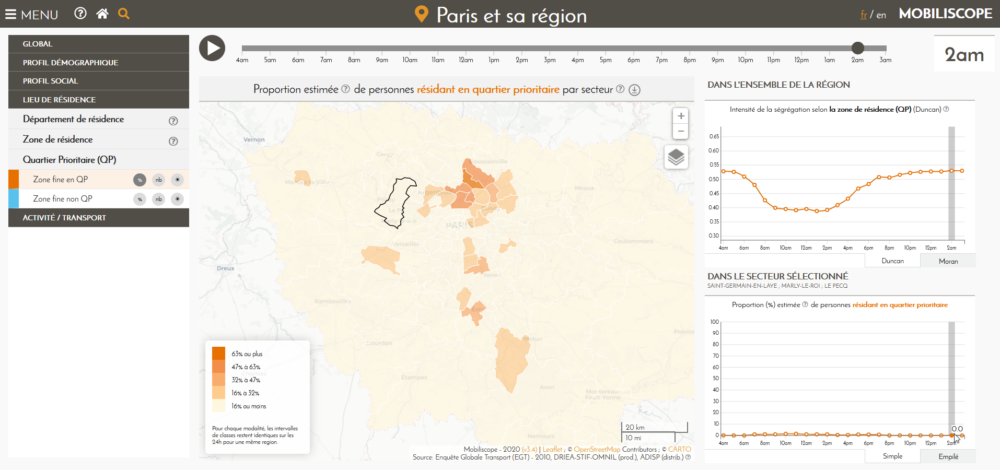
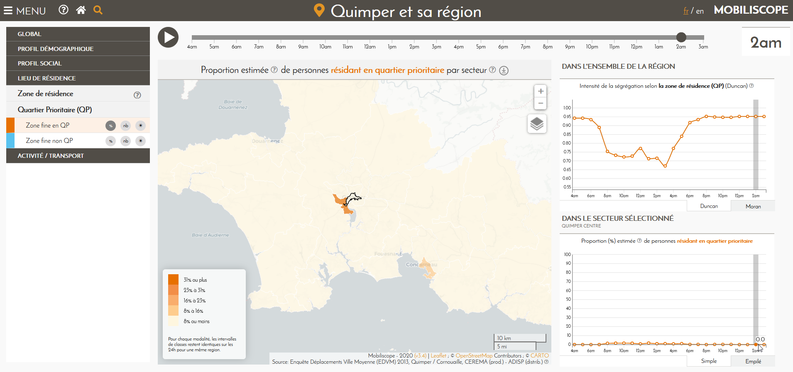
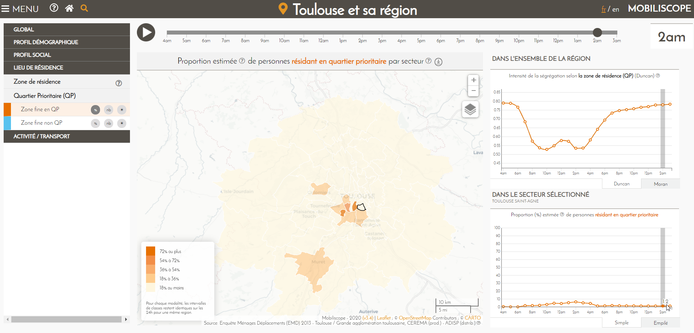

## Préambule

Les enquêtes ménage déplacement (EMD) ne nous renseignent pas sur la résidence des participants en quartier prioritaire ; nous connaissons en revanche leur zone fine de résidence. L'information "résidence en QPV" est donc à créer, à partir de la géographie des QPV et des données fournies par l'Insee, pour les zones fines (ZF) sur lesquelles se sont appuyées les EMD pour interroger les ménages et qui constitue le maillage le plus fin à notre disposition. 

Ce document décrit la procédure de calcul de la variable "habitant d'un quartier
prioritaire en politique de la ville (QPV)" à inclure dans le Mobiliscope.

Dans un premier temps (*cf.* Étape 1), l'objectif est d'attribuer aux ZF une population résidente en QPV et une population résidente totale, afin d'obtenir un ratio d'habitant en QPV pour chaque zone fine. Le deuxième temps de la démarche (*cf.* Étape 2) consistera à déterminer à partir de quelle valeur de ratio une ZF peut être considérée en QPV et d'affecter cette information aux enquêtés selon leur zone fine de résidence.

*Sources des données mobilisées : *

* QPV - géographie : [CGET, Périmètre des quartiers prioritaires de la politique de la ville 2015](https://www.data.gouv.fr/fr/datasets/quartiers-prioritaires-de-la-politique-de-la-ville-qpv/)
* QPV - démographie : [Insee, Quartier de la politique de la ville 2015, RP 2013](https://www.insee.fr/fr/statistiques/2500431?sommaire=2500477)
* Carroyage 200m : [Insee, Données carroyées, Filosofi 2015](https://www.insee.fr/fr/statistiques/4176281?sommaire=4176305)

* Communes - géographie : [Geofla®Communes édition 2015](https://geoservices.ign.fr/documentation/diffusion/telechargement-donnees-libres.html#geofla)
* Communes - recensement : [Insee, RP, Chiffres clés-Évolution et structure de la population en 2013 (géographie au 1er janvier 2015)](https://www.insee.fr/fr/statistiques/2044751)


```{r, include=FALSE}

options(scipen = 999)

# libraries
library(sf)
library(lwgeom) #topology
library(tidyverse)
library(tidylog)
```

## Étape 1: Calcul du ratio de population en QPV pour chaque zone fine 

```{r ldZF, include=FALSE, cache=TRUE}
# load ZF
zf <- st_read("../../../shp/BDGEO/ZF_50ED_W84.shp") 

zf_fr <- zf %>%
  filter(!LIB_ED %in% c("Saint-Denis, 2016", "Fort-de-France, 2014")) %>% 
  st_transform(crs = 2154)

zf_lr <- zf %>% 
  filter(ENQUETE == "LA REUNION") %>% 
  st_transform(crs = 2975)

zf_ma <- zf %>% 
  filter(ENQUETE == "MARTINIQUE") %>% 
  st_transform(crs = 5490)

```


### 1.1. Population résidente totale dans les zones fines

Les zones fines ne correspondent à aucun maillage administratif habituel pour lequel on disposerait d'une information statistique (autre que celle des EMD). Elles ont été construites, par différentes maîtrises d'ouvrage, à différentes dates, et à partir de différentes sources : contour des communes, des Iris ou d'un découpage à façon, infra-Iris. Cas particulier, les zones fines de l'Île-de-France résultent d'un carroyage très fin de toute la région (carreaux de 100 mètres de côté) où seuls ont été conservés, pour notre BD géographique, les carreaux dont l'identifiant est mentionné dans la BD attributaire. 

Pour obtenir la population résidente totale des zones fines, nous avons choisi de travailler avec le carroyage fin de l'Insee (carreau de 200 mètres de côté). Les carreaux permettent en effet de s’affranchir des limites administratives et peuvent être assemblés pour approcher notre zonage. La population peut ensuite être retrouvée en collectant les données des carreaux au sein de chaque zone fine.

```{r ldCar, include=FALSE, cache=TRUE}

# load carroyage Insee 200m
# Filosofi 2015
## France métropolitaine (sélection des carreaux qui intersectent les ED sous Qgis)
car_fr <- st_read("data_source/Filosofi2015_carreaux_200m_shp/Filosofi2015_carreaux_200m_metropole_shp_selection.shp") %>% 
  st_transform(crs = 2154)

## La Réunion
car_lr <- st_read("data_source/Filosofi2015_carreaux_200m_shp/Filosofi2015_carreaux_200m_reg04_shp/Filosofi2015_carreaux_200m_reg04.shp") %>%
  st_transform(crs = 2975)

## Martinique
car_ma <- st_read("data_source/Filosofi2015_carreaux_200m_shp/Filosofi2015_carreaux_200m_reg02_shp/Filosofi2015_carreaux_200m_reg02.shp") %>% 
  st_transform(crs = 5490)

```


Dans un premier temps, on attribue une population résidente totale pour chaque zone fine par interpolation de la couche des carreaux de l'Insee, vers la couche des ZF :


```{r echo=FALSE, include=FALSE}
# Check topology
# sum(st_is_valid(zf_fr)==FALSE)
```

```{r echo=FALSE, include=FALSE}
## use code below if not valid
zf_fr <- st_make_valid(zf_fr)
zf_fr <- st_collection_extract(zf_fr, type = c("POLYGON"))
```

```{r echo=TRUE, cache=TRUE}

# interpolate pop carreau on zf
interp_popCar_fr <- st_interpolate_aw(car_fr["Ind"], zf_fr, extensive = TRUE)

```

```{r include=FALSE, cache=TRUE}

# interpolate pop carreau on zf
interp_popCar_lr <- st_interpolate_aw(car_lr["Ind"], zf_lr, extensive = TRUE)
interp_popCar_ma <- st_interpolate_aw(car_ma["Ind"], zf_ma, extensive = TRUE)

```

```{r include=FALSE}

# Add result on zf
interp_popCar_fr <- interp_popCar_fr %>% st_drop_geometry()
zf_fr <- zf_fr %>% 
  mutate(idInter = as.numeric(rownames(.))) %>% 
  left_join(., select(interp_popCar_fr, Group.1, POP_CAR = Ind), 
            by = c( "idInter" = "Group.1")) 

interp_popCar_lr <- interp_popCar_lr %>% st_drop_geometry()
zf_lr <- zf_lr %>% 
  mutate(idInter = as.numeric(rownames(.))) %>% 
  left_join(., select(interp_popCar_lr, Group.1, POP_CAR = Ind), 
            by = c( "idInter" = "Group.1")) 

interp_popCar_ma <- interp_popCar_ma %>% st_drop_geometry()
zf_ma <- zf_ma %>% 
  mutate(idInter = as.numeric(rownames(.))) %>% 
  left_join(., select(interp_popCar_ma, Group.1, POP_CAR = Ind), 
            by = c( "idInter" = "Group.1")) 

rm(interp_popCar_fr, interp_popCar_lr, interp_popCar_ma)

```

 

### 1.2. Population résidente en QPV dans les zones fines 

```{r include=FALSE, cache=TRUE}

# load qpv
# pop 2013 - géo 2015
qpv_fr <- st_read("data_source/qp-politiquedelaville-shp/QP_METROPOLE_LB93.shp")
qpv_lr <- st_read("data_source/qp-politiquedelaville-shp/QP_LAREUNION_RGR92_UTM40S.shp")
qpv_ma <- st_read("data_source/qp-politiquedelaville-shp/QP_MARTINIQUE_WGS84_UTM20N.shp") %>% 
  st_transform(crs = 5490)

qpv_demo <- read_delim("data_source/qpv_insee/pop_qp_2013.csv", 
                       ";", escape_double = FALSE, col_types = cols(reg = col_character(), 
                                                                    epci1 = col_character()), trim_ws = TRUE)

```


```{r include=FALSE}

# Join pop to shape
qpv_fr <- qpv_fr %>% 
  left_join(., select(qpv_demo, CODE_QP = qp, CODE_REG = reg, 
                      COM = liste_des_communes, POP_QPV = population_municipale_2013))

qpv_lr <- qpv_lr %>% 
  left_join(., select(qpv_demo, CODE_QP = qp, CODE_REG = reg, 
                      COM = liste_des_communes, POP_QPV = population_municipale_2013))

qpv_ma <- qpv_ma %>% 
  left_join(., select(qpv_demo, CODE_QP = qp, CODE_REG = reg, 
                      COM = liste_des_communes, POP_QPV = population_municipale_2013))

rm(qpv_demo)
```

On attribue ensuite une population résidente en QPV dans chaque zone fine, par interpolation de la couche des QPV vers la couche des ZF :

```{r include=FALSE}
# check topology
sum(st_is_valid(qpv_fr)==FALSE)
sum(st_is_valid(qpv_lr)==FALSE)
sum(st_is_valid(qpv_ma)==FALSE)

qpv_fr <- st_make_valid(qpv_fr)
qpv_lr <- st_make_valid(qpv_lr)

```

```{r include=TRUE, cache=TRUE}

# interpolate pop qpv on zf
interp_popQpv_fr <- st_interpolate_aw(qpv_fr["POP_QPV"], zf_fr, extensive = TRUE)

```

```{r include=FALSE, cache=TRUE}

# interpolate pop qpv on zf
interp_popQpv_lr <- st_interpolate_aw(qpv_lr["POP_QPV"], zf_lr, extensive = TRUE)
interp_popQpv_ma <- st_interpolate_aw(qpv_ma["POP_QPV"], zf_ma, extensive = TRUE)

```

```{r include=FALSE}

# Add result
interp_popQpv_fr <- interp_popQpv_fr %>% st_drop_geometry()
zf_fr <- zf_fr %>% 
  left_join(., select(interp_popQpv_fr, Group.1, POP_QPV), 
            by = c( "idInter" = "Group.1")) %>% 
  st_transform(crs = 4326)

interp_popQpv_lr <- interp_popQpv_lr %>% st_drop_geometry()
zf_lr <- zf_lr %>% 
  left_join(., select(interp_popQpv_lr, Group.1, POP_QPV), 
            by = c( "idInter" = "Group.1")) %>% 
  st_transform(crs = 4326)

interp_popQpv_ma <- interp_popQpv_ma %>% st_drop_geometry()
zf_ma <- zf_ma %>% 
  left_join(., select(interp_popQpv_ma, Group.1, POP_QPV), 
            by = c( "idInter" = "Group.1")) %>% 
  st_transform(crs = 4326)

rm(interp_popQpv_fr, interp_popQpv_lr, interp_popQpv_ma)

# join zf shape
zf <- rbind(zf_fr, zf_lr, zf_ma)

rm(zf_fr, zf_lr, zf_ma)

```

La couche des ZF contient deux nouvelles variables résultant de ces deux interpolations, "POP_CAR" et "POP_QPV" :

```{r include=TRUE}
head(zf[, c(1, 5, 13, 17, 18)])
```


### 1.3. Ratio de population en QPV

On peut ensuite calculer pour chaque zone fine le ratio d'habitant en QPV qui est le rapport entre la population résidente en QPV (POP_QPV) et la population totale résidente (POP_CAR) :


```{r echo=TRUE}

# Add ratio
zf <- zf %>%
  mutate(RATIO_QPV = POP_QPV/POP_CAR)

```

Les résultats de l’[interpolation](https://cran.r-project.org/web/packages/areal/vignettes/areal-weighted-interpolation.html) des populations sont, par construction, fortement dépendants des surfaces : 

* Lorsque les carreaux Insee sont plus vastes que les zones fines, on obtient un effet de lissage des populations à l'échelon des zones fines, en particulier dans les zones densément peuplées où le maillage des zones fines est parfois plus serré que celui du carroyage Insee. C'est le cas en Île-de-France où la couche des ZF est elle-même constituée d'une grille de carreaux deux fois plus petits que ceux de l'Insee. On perd alors les différentiels de densité et les ratios peuvent dépasser les 100% (une petite zone fine avec une population totale - issue de l'interpolation des carreaux Insee - plus faible que la population interpolée en QPV aura un ratio d'habitant en QPV supérieur à 1). Ce biais de construction est corrigé en ramenant à 1 toutes les valeurs de ratio supérieures à 1.

* La grille des carreaux de 200m de l'Insee n'est pas totalement couvrante : lorsqu'une zone fine se situe au sein d'un QPV et n'est couverte que par une infime surface d'un carreau Insee, elle reçoit une population interpolée en QPV largement supérieure à sa population totale - issue de l'interpolation des carreaux Insee - qui, elle, est proche de zéro. Dans ce cas, on obtient des ratios extrêmement élevés bien que ces zones fines ne soient pas habitées. Ce sont en fait des espaces verts ou des espaces d'activité situés dans le périmètre des QPV couverts par une infime portion du carroyage Insee. Ces ratios sont également ramenés à 1 et, au moment de l'étape 2 (*cf.* infra), ils ne sont pas attribués puisqu'ils ne correspondent à aucune ZF de résidence. 

```{r include=FALSE}

#bivariate overlook of populations
zfqpv_df <- zf %>% 
  filter(!is.na(RATIO_QPV)) %>% 
  select(LIB_ED, ENQUETE, CODE_ZF, POP_CAR, POP_QPV) %>% 
  st_drop_geometry()

require(GGally)
zfqpv_df %>% keep(is.numeric) %>% ggpairs()
zfqpv_df %>% filter(ENQUETE!="IDF") %>% keep(is.numeric) %>% ggpairs()
zfqpv_df %>% filter(ENQUETE=="IDF") %>% keep(is.numeric) %>% ggpairs()

zfqpv_df <- zfqpv_df %>% 
  left_join(., select(zf, LIB_ED, ENQUETE, CODE_ZF, RATIO_QPV)) %>% 
  mutate(over1 = case_when(RATIO_QPV > 1.1 ~ TRUE,
                           TRUE ~ FALSE)) %>% 
  select(-geometry) %>% 
  as.data.frame()

ratioSup_df <- zfqpv_df %>% filter(over1 == TRUE)

PratioSup <- nrow(ratioSup_df)*100/nrow(zfqpv_df)

```

*Résumé statistique des ratios supérieurs à 1,01 ( `r nrow(ratioSup_df)` ZF avec un ratio supérieur à 1, soit `r round(PratioSup)`% des ZF avec une population QPV) :*

```{r echo=FALSE, include=TRUE}

# skim
require(skimr)
skim_without_charts(ratioSup_df[6])

```
*Histogrammes des ratios supérieurs à 1,01 :*

```{r include=FALSE}

# histogramm
zf_histo <- ratioSup_df %>% select(LIB_ED, ENQUETE, CODE_ZF, RATIO_QPV)
histo_ratio <- zf_histo %>% keep(is.numeric) %>% 
  gather() %>% 
  ggplot(aes(value)) + 
  geom_histogram() +
  scale_x_log10() +
  labs(y = "Nombre de ZF", x = "Valeurs du ratio (log10)")

```

```{r echo=FALSE, include=TRUE}
histo_ratio
```

```{r include=FALSE}
rm(histo_ratio, ratioSup_df, zf_histo, PratioSup)
```

Par ailleurs, il ne faut pas perdre de vue que les différentiels de population résultent aussi des sources des données : les estimations de population en QPV sont en référence du recensement de la population de 2013 tandis que les données carroyées résultent de l'exploitation des fichiers fiscaux (Filosofi 2015).

Néanmoins, en dehors des cas cités précédemment, l'interpolation des données carroyées offre l'avantage de palier les effets de lissage de population que l'on aurait sur les zones fines en utilisant le maillage des Iris ou des communes (où la population de l'iris ou de la commune serait équitablement répartie au sein des zones fines qui le ou la compose). En effet, en raison de la finesse du carroyage qui recouvre uniquement les espaces habités à l'intérieur de chaque zone fine, les différentiels de densités inter-zones sont ainsi mieux abordées.


```{r include=FALSE}

# ratio > 1
zf <- zf %>% 
  mutate(RATIO_QPV_CORR = case_when(RATIO_QPV >= 1 ~ 1,
                                    RATIO_QPV < 1 ~ RATIO_QPV))

```


*Résumé statistique des populations et des ratios (nombre de ZF avec une population QPV = `r nrow(zfqpv_df)`) :*

```{r include=FALSE}
zf_df <- zf %>% st_drop_geometry()
```

```{r echo=FALSE, include=TRUE}
# skim
require(skimr)
#skim(zf_df[13:16]) %>% print.listof(locale = locale(encoding = "UTF8"))
skim_without_charts(zf_df[17:20])

```

*Histogrammes du ratio et du ratio corrigé :*

```{r include=FALSE}

# histogramm
zf_histo <- zf_df %>% select(LIB_ED, ENQUETE, CODE_ZF, RATIO_QPV, RATIO_QPV_CORR)
histo_ratio <- zf_histo %>% keep(is.numeric) %>% 
  gather() %>% 
  ggplot(aes(value)) + 
  facet_wrap(~ key, scales = "free") +
  geom_histogram() +
  scale_y_log10() +
  labs(y = "Nombre de ZF (log10)", x = "Valeurs du ratio")

```


```{r echo=FALSE, include=TRUE}
histo_ratio
```

```{r include=FALSE}
rm(histo_ratio, zf_histo, zfqpv_df)
```


## Étape 2 : Qualification des participants EMD selon leur zone fine de résidence

### 2.1. Joindre le ratio à la table des présences 

Pour chaque participant des enquêtes ménage déplacement, on affecte le ratio selon leur ZF de résidence.


```{r include=FALSE, cache=FALSE}
# load table de présence
prezTable <- readRDS("BD_presence_humanum.RDS")

prezTable <- prezTable %>% 
  relocate(PAYS)

## Clé de jointure
prezTable <- prezTable %>% 
  mutate(ID = paste(LIB_ED, RES_ZF, sep = "_")) 
```

```{r include=FALSE}

# df zf with qpv
zfqpv <- zf_df %>% 
  filter(!is.na(RATIO_QPV_CORR)) %>% 
  mutate(ID = paste(LIB_ED, CODE_ZF, sep = "_")) %>% 
  select(ID, RATIO_QPV_CORR)

length(unique(zfqpv$ID))

```

```{r include=FALSE}

# join ratio 
prezTable <- prezTable %>% 
  left_join(., zfqpv) 

# na
prezTable <- prezTable %>%
  mutate(RATIO = replace_na(RATIO_QPV_CORR, 0))

```

```{r include=FALSE}

myPrez <- prezTable %>% 
  filter(ENQUETE == "ALBI" & ID_IND == "81004_004009_00005_01_tel")

```

*Extrait de la table des présences pour un individu résidant dans une ZF à 64% en QPV :*
```{r echo=FALSE, include=TRUE}
head(myPrez[, c(2, 4, 6, 8, 10:12, 49:50, 63)])

```

L'objectif est ensuite de qualifier les participants selon qu'ils sont :

* Habitant d'une zone fine en QPV
* Habitant d'une zone fine hors QPV


Pour cela, il est nécessaire de déterminer le seuil (parmi les différentes valeurs du ratio) à partir duquel les ZF sont considérées en QPV.

### 2.2. Détermination d'un seuil de découpage du ratio  

Cette démarche s'appuie sur une comparaison avec les données du recensement de l'Insee. Dans un premier temps, on somme, pour chaque enquête, les populations recensées dans les QPV et en dehors des QPV (population des communes - population en QPV) :


```{r ldIris, include=FALSE, cache=TRUE}

# load données Géofla
# RP2013 - géo 2015
## communes incluses dans le périmètre des ED (cf.constructionBDGeo/com15_ed50.R)
com <- st_read("com15_50ed_W84.shp")
length(unique(com$INSEE_COM))

```

```{r include=FALSE}

# load données Insee
# chiffres clés RP2013
comPop <- read.csv2("data_source/rp_insee/P13_POP_insee.csv",
                     encoding = "UTF-8", colClasses = c(rep("character", 2), "numeric"))

```

```{r include=FALSE}

# and join pop to shape
com <- com %>% 
  left_join(., select(comPop, INSEE_COM = CODGEO, POP_COM = P13_POP), by = "INSEE_COM")


# Clean
rm(comPop)

```

```{r include=FALSE, cache=TRUE}

# load emprise des 50 ED
emprise <- st_read("PERIMETRE_50ED_W84.shp")

emprise_fr <- emprise %>% 
  filter(!ENQUETE %in% c("LA REUNION", "MARTINIQUE")) %>% 
  st_transform(crs = 2154)

emprise_lr <- emprise %>%
  filter(ENQUETE == "LA REUNION") %>% 
  st_transform(2975)

emprise_ma <- emprise %>%
  filter(ENQUETE == "MARTINIQUE") %>% 
  st_transform(5490)

#sum(st_is_valid(emprise)==FALSE)

```

```{r include=FALSE, cache=TRUE}

# Compter les pop recensées par ed
com_ed_sum <- com %>% 
  st_drop_geometry() %>% 
  group_by(LIB_ED) %>% 
  summarise(POP_TOT = sum(POP_COM, na.rm = TRUE))

# intersection emprise/qpv
qpv_ed_fr <- st_intersection(qpv_fr %>% st_make_valid(), emprise_fr %>% st_make_valid())
qpv_ed_fr_sum <- qpv_ed_fr  %>% 
  st_drop_geometry(.)%>% 
  group_by(LIB_ED) %>% 
  summarise(POP_DANSQPV = sum(POP_QPV, na.rm = TRUE))

qpv_ed_lr <- st_intersection(qpv_lr %>% st_make_valid(), emprise_lr %>% st_make_valid())
qpv_ed_lr_sum <- qpv_ed_lr  %>% 
  st_drop_geometry(.)%>% 
  group_by(LIB_ED) %>% 
  summarise(POP_DANSQPV = sum(POP_QPV, na.rm = TRUE))

qpv_ed_ma <- st_intersection(qpv_ma %>% st_make_valid(), emprise_ma %>% st_make_valid())
qpv_ed_ma_sum <- qpv_ed_ma  %>% 
  st_drop_geometry(.)%>% 
  group_by(LIB_ED) %>% 
  summarise(POP_DANSQPV = sum(POP_QPV, na.rm = TRUE))

qpv_ed_sum <- rbind(qpv_ed_fr_sum, qpv_ed_lr_sum, qpv_ed_ma_sum)

rm(qpv_ed_fr, qpv_ed_lr, qpv_ed_ma, qpv_ed_fr_sum, qpv_ed_lr_sum, qpv_ed_ma_sum)

# Déduire les habitants non QPV et pourcentage
## non QPV
popInsee <- left_join(com_ed_sum, qpv_ed_sum)
popInsee <- popInsee %>%
  mutate(POP_DANSQPV = replace_na(POP_DANSQPV, 0),
         POP_HORSQPV = POP_TOT - POP_DANSQPV)

## Pourcentage
popInsee <- popInsee %>%
  mutate(POP_HORSQPV_PCT = round(POP_HORSQPV*100 / POP_TOT, 2),
         POP_DANSQPV_PCT = round(POP_DANSQPV*100 / POP_TOT, 2),
         POP_TOT_PCT = POP_HORSQPV_PCT + POP_DANSQPV_PCT)

```

```{r include=FALSE}

# INTERLUDE Pour Julie : Pop Insee totale par enquête
com_ed_sum <- com_ed_sum %>% 
  transmute(LIB_ED, POP_RESIDENTE_INSEE = POP_TOT)

# + nombre médian (max et min) de participants interrogés (16 ans et +) résident par secteur
## Filtrer
rezParSec <- prezTable %>% 
  filter(PAYS == "FR") %>% 
  filter(AGE > 15 & CODE_SEC != "999" & CODE_SEC != "888") %>%
  filter(CODE_SEC == RES_SEC) %>% 
  group_by(LIB_ED, CODE_SEC) %>% 
  summarise(POP_SEC = length(unique(ID_IND))) %>% 
  group_by(LIB_ED) %>% 
  summarise(MED_POP_SEC = round(median(POP_SEC)),
            MIN_POP_SEC = min(POP_SEC),
            MAX_POP_SEC = max(POP_SEC))

com_ed_sum <- com_ed_sum %>% 
  left_join(., rezParSec)

write.csv2(com_ed_sum, "popResInsee_50ED.csv", row.names = FALSE, fileEncoding = "UTF8")

# Clean
rm(com_ed_sum, qpv_ed_sum, rezParSec)
rm(emprise, emprise_fr, emprise_lr, emprise_ma)

```

#### Population de référence Insee - extrait :

```{r echo=FALSE, include=TRUE}
head(popInsee)
```
Par exemple, à Angers, 10% de la population recensée habitent dans un QPV, tandis que Annecy n'a pas de quartier prioritaire.


Dans un deuxième temps, on réalise, pour chaque enquête, l’histogramme cumulé de la distribution du nombre pondéré de participants afin d'observer vers quelle valeur de ratio il faudrait couper pour que la part de participants habitant en QPV corresponde à celle de l’Insee. 


```{r include=FALSE}

# Prepare data 

## poussière retourne à la poussière
df <- prezTable %>% 
  mutate(RATIO = case_when(RATIO < 0.05 ~ 0,
                           TRUE ~ round(RATIO, 3)))

## compter le nombre de participants pondérés par EMD et par ratio
df <- df %>% 
  filter(!duplicated(ID_IND)) %>% 
  group_by(LIB_ED, RES_ZF, RATIO) %>% 
  summarise(popzf = sum(W_IND))

## rm res_zf na
df <- df %>% 
  filter(!is.na(RES_ZF))

## Calculer la somme cumulée de pop pour chaque ratio
df_cum <- df %>% 
  group_by(LIB_ED, RATIO) %>% 
  summarise(n = sum(popzf)) %>% 
  arrange(LIB_ED, desc(RATIO)) 

## %
df_cum <- df_cum %>% 
  group_by(LIB_ED) %>% 
  mutate(n_cum = cumsum(n),
         pop_ratio_P = n_cum*100 / sum(n)) %>% 
  filter(LIB_ED != "Annecy, 2017")

```


```{r include=FALSE, cache=TRUE}
# histogramme cumulé et tableau avec seuil
require(gghighlight)

listPlot <- list()
listDf <- list()
for (i in unique(df_cum$LIB_ED)) {
  
  myVal <- popInsee %>% filter(LIB_ED == i)
  myVal <- myVal$POP_DANSQPV_PCT
  
  myDf <- df_cum %>% 
    mutate(RATIO = as.character(RATIO)) %>% 
    filter(LIB_ED == i)
  loc <- which.min(abs(myDf$pop_ratio_P - myVal))
  lh <- myDf[loc, "pop_ratio_P"]$pop_ratio_P

  myDf <- myDf %>% 
    mutate(hl = ifelse(pop_ratio_P == lh, "yes", "no"))
  
  ratio <- myDf %>% filter(hl == "yes")
  ratio <- ratio$RATIO

  listPlot[[i]] <- ggplot(myDf, 
                        aes(x = RATIO, y = pop_ratio_P)) +                              
    geom_col() +
    scale_x_discrete(guide = guide_axis(n.dodge = 2)) +
    geom_hline(yintercept = myVal, color = "red") +
    annotate("text", x = 1, y = myVal, size = 3, color = "red", 
             label = paste0("Pop QPV insee = ", myVal, "%"), 
             hjust = 0, vjust = -0.5) +
    ggtitle(i) +
    xlab("RATIO") + ylab("Participants pondérés cumulés (%)")+
    theme(axis.text.x  = element_text(size =8),
          legend.position = "none") +
    gghighlight(hl == "yes") +
    annotate("text", x = length(myDf$RATIO) - 4, y = 75, size = 3, color = "grey30",
             label = paste0("Seuil = ", ratio), hjust = 1)
  
  listDf[[i]] <- myDf
  
}
```

```{r include=FALSE}
rm(myDf, i, lh, loc, myVal, ratio)
```

```{r include=FALSE}

# stocker tous les plots dans un liste et en sortir n par planche
Gridplot <- function(myplots, n){
  
  require(cowplot)
  
  splitted_plots <- split(myplots, ceiling(seq_along(myplots)/n))
  
  lapply(splitted_plots, function(x) plot_grid(plotlist = x))
  
}

grid <- Gridplot(listPlot, 9) 
```


#### Histogrammes cumulés - extrait :

*Histogramme cummulé pour les 9 premières EMD :*
```{r include=TRUE, fig.height = 10, fig.width = 12}
grid[[1]]
```
*Histogramme cummulé pour Albi :*
```{r include=TRUE}
listPlot["Albi, 2011"]
```

Par exemple, à Albi (et «sa région»), on compte 6.31% d’habitants en QPV parmi la population totale recensée par l’Insee. Pour obtenir la même proportion de participants pondérés résidant en QPV, il faudrait couper la distribution du ratio à la valeur de 0,059. Au-dessus de ce seuil, les zones fines sont considérées en QPV ; en dessous de ce seuil, les zones fines sont hors QPV.


Cependant, pour éviter d'appliquer un seuil variable selon les enquêtes, nous utilisons une seule et même valeur pour l'ensemble des EMD en nous appuyant sur les valeurs centrales de ces différents seuils :


```{r include=FALSE}

# Récupération des valeurs de seuil
seuils <- bind_rows(listDf, .id = "LIB_ED")
seuils <- seuils %>% 
  filter(hl == "yes") %>% 
  select(LIB_ED, SEUIL = RATIO) %>% 
  mutate(SEUIL = as.numeric(SEUIL))

rm(listDf)

```

```{r include=TRUE}
median(seuils$SEUIL)
```

```{r include=TRUE}
mean(seuils$SEUIL)
```

Pour définir les deux catégories de résidents (en QPV ou non), le seuil est fixé à **`r round(median(seuils$SEUIL), 2)`** qui correspond à la médiane des seuils des `r length(unique(seuils$LIB_ED))` EMD étudiées.

*Liste des seuils de chaque enquête :*
```{r echo=FALSE, include=TRUE}
require(knitr)
kable(seuils)
```


### 2.3. Discrétisation du ratio selon le seuil fixé

On ajoute la variable "QPV" à la table des présences. Cette nouvelle variable se décline en deux modalités :

* 1 : Habitant d'une ZF en QPV (ratio > `r round(median(seuils$SEUIL), 2)`) 
* 0 : Habitant d’une ZF non QPV (ratio <= `r round(median(seuils$SEUIL), 2)`)


```{r include=FALSE}
# Création de la variable 'QPV'
# 1 = zf en QPV ; 0 = zf hors QPV
prezTable <- prezTable %>% 
  mutate(QPV = case_when(RATIO > median(seuils$SEUIL) ~ 1,
                         RATIO <= median(seuils$SEUIL) ~ 0))
```


```{r include=FALSE}
myPrez2 <- prezTable %>% 
  filter(ENQUETE == "ALBI" & ID_IND == "81004_004009_00005_01_tel")
```


*Extrait de la table des présences pour un individu résidant dans une ZF en QPV :*
```{r echo=FALSE, include=TRUE}
head(myPrez2[, c(2, 4, 6, 8, 10:12, 49:50, 63:64)])
```

```{r include=FALSE}
# Sauvegarde de la table des présences
prez2save <- prezTable %>% select(-RATIO, -RATIO_QPV_CORR, -ID)
saveRDS(prez2save, "BD_presence.RDS")

```

```{r include=FALSE}
# Pour Julie
lulu <- prezTable %>%
  mutate(ID_REZ_ZF = paste0(LIB_ED, "_", RES_ZF)) %>%
  select(ID_REZ_ZF, LIB_ED, RES_ZF, RATIO, QPV) %>%
  filter(!duplicated(ID_REZ_ZF))

write.csv2(lulu, "table_resZF_qpv.csv", row.names = FALSE)

rm(lulu)

```

```{r echo=FALSE, include=FALSE}

# Nombre de ZF en QPV
bibi <- prezTable %>% 
  group_by(LIB_ED, RES_ZF) %>% 
  filter(!duplicated(RES_ZF)) %>% 
  group_by(LIB_ED, QPV) %>% 
  summarise(n = n())

bibi2 <- prezTable %>% 
  group_by(LIB_ED, RES_ZF) %>% 
  filter(!duplicated(RES_ZF)) %>% 
  group_by(QPV) %>% 
  summarise(n = n())

```

```{r include=FALSE}
rm(df, df_cum, grid, listPlot, myPrez, myPrez2, bibi, bibi2, Gridplot)
```


```{r include=FALSE}

# Comptabilisation des enquêtés pondérés par classe de ratio

## Nb brut d'habitant en QPV enquêtés par ED
pop_brut <- prezTable %>% 
  filter(PAYS == "FR") %>% 
  group_by(LIB_ED, QPV) %>%
  filter(!duplicated(ID_IND)) %>% 
  summarise(POP_BRUTE = n())

## pop pondérée totale par ed (variable de contrôle)
pop_ed <- prezTable %>% 
  filter(PAYS == "FR") %>% 
  group_by(LIB_ED) %>% 
  filter(!duplicated(ID_IND)) %>% 
  summarise(POP_ED = round(sum(W_IND, na.rm = TRUE))) %>% 
  ungroup()

## pop pondérée par classe de ratio
pop_qpvK <- prezTable %>%
  filter(PAYS == "FR") %>%
  group_by(LIB_ED, QPV) %>% 
  filter(!duplicated(ID_IND)) %>% 
  summarise(POP_QPV = round(sum(W_IND, na.rm = TRUE))) %>% 
  left_join(., pop_brut)

### pivot
pop_qpvK_w <- pop_qpvK %>% 
  pivot_wider(., names_from = QPV, values_from = c(POP_QPV, POP_BRUTE))

pop_qpvK_w <- pop_qpvK_w %>% 
  mutate(POP_QPV_1 = replace_na(POP_QPV_1, 0),
         POP_BRUTE_1 = replace_na(POP_BRUTE_1, 0))

### contrôle
pop_qpvK_w <- pop_qpvK_w %>% 
  mutate(TOT = sum(POP_QPV_1, POP_QPV_0)) %>% 
  left_join(., pop_ed)

# Pourcentage
pop_qpv_P <- pop_qpvK_w %>% 
  mutate(HORS_QPV = round(POP_QPV_0*100 / POP_ED, 2),
         EN_QPV = round(POP_QPV_1*100 / POP_ED, 2),
         TOT_P = sum(HORS_QPV, EN_QPV))

rm(pop_ed, pop_qpvK, pop_qpvK_w, zfqpv)
```


## Résultats 


### Tableau comparatif des différentes populations 

```{r include=FALSE}

# Comparaison avec les données INSEE
pop2compare <- pop_qpv_P %>% 
  select(LIB_ED, 
         `Habitant d'une ZF en QPV (Nb brut d'enquêtés)` = POP_BRUTE_1,
         `Habitant d’une ZF non QPV (Nb pondéré - % du total)` = HORS_QPV,
         `Habitant d’une ZF en QPV (Nb pondéré - % du total)` = EN_QPV) %>% 
  left_join(., select(popInsee, LIB_ED,
                      `Population recensée en dehors des QPV (% du total)` = POP_HORSQPV_PCT,
                      `Population recensée dans les QPV (% du total)` = POP_DANSQPV_PCT))


```

<a id="pop2compare"></a>
```{r pop2compare, echo=FALSE, include=TRUE}
require(knitr)
kable(pop2compare)
```

Le tableau comparatif nous montre des résultats proches entre les deux populations malgré le choix d'un seuil de discrétisation identique pour toutes les enquêtes, ce que confirme la régression linéaire suivante.  

NB : La différence du nombre d'habitant en QPV entre Valenciennes 2011 et Valenciennes 2019 ne résultent pas d'une baisse de population dans les QPV mais d'une modification du périmètre de l'enquête entre les deux dates. On compte un qpv de moins en 2019.

### Régression linéaire entre la population Insee en QPV (x) et la population du Mobiliscope en QPV (y)

```{r include=FALSE}
reg <- lm(`Habitant d’une ZF en QPV (Nb pondéré - % du total)`~`Population recensée dans les QPV (% du total)`, data = pop2compare)

summary(reg)

eq <- paste0("y = ", round(reg$coefficients[2], 2), "x + ", round(reg$coefficients[1], 2))
```

```{r include=FALSE}
regPlot <- ggplot(pop2compare, 
                  aes(x = `Population recensée dans les QPV (% du total)`,
                      y = `Habitant d’une ZF en QPV (Nb pondéré - % du total)`)) +
  geom_point () +
  theme_light() +
  geom_abline(intercept = reg$coefficients[1], slope = reg$coefficients[2],
              color="#E69F00", linetype = "dashed", size = 1.5) +
  annotate(geom = "text", x = 0, y = 15, hjust = 0,
           label = paste0(eq, "\nR2 = ", round(summary(reg)$r.squared, 2))) 
```

```{r include=FALSE}
regPlot
```

```{r include=FALSE}

# Residuals
## add residuals and standart residuals to df
pop2compare <- pop2compare %>% 
  ungroup %>% 
  mutate(rezStand = residuals(reg, type = "pearson"))

sdRez <- sd(pop2compare$rezStand)

```

```{r include=FALSE}

# Fonction pour identifier des outliers dans une distribution :
is_outlier <- function(x) {
  
  return(x < -2 * sdRez | x > 2 * sdRez)
  
}
```

```{r include=FALSE}
# Outliers
pop2compare <- pop2compare %>%
  mutate(outlier = ifelse(is_outlier(rezStand), 
                          rezStand, 
                          as.numeric(NA)))

```

```{r echo=FALSE, include=TRUE}

require(ggrepel)
# plot with ouliers
regPlot +
  geom_label_repel(data = pop2compare %>% filter(!is.na(outlier)), 
                   aes(label = LIB_ED),
                   na.rm = TRUE, nudge_y = 0.05, color = "black", size = 2.5)

```

Les résultats de la régression sont très significatifs :

* les points sont bien alignés sur la droite de régression : il existe bien une relation linéaire et positive entre les deux populations
* le paramètre *a* est proche de 1 : la population du Mobiliscope en QPV varie dans les mêmes proportions que la population Insee en QPV
* le paramètre *b* (`r round(reg$coefficients[1], 2)`) est quasi nul : il n'y a pas de sous- ou surestimation importante de la population présente dans le Mobiliscope par rapport à la population recensée (lorsque x = 0, y =`r round(reg$coefficients[1], 2)`). Nice, Angoulême et Fort-de-France sont les EMD qui s'écartent le plus du modèle.
* Le coefficient de détermination (R2) est proche de 1 : la population recensée en QPV explique 92% de la variation de population en QPV estimée du Mobiliscope, le restant pouvant s'expliquer par des configurations géométriques et des biais de construction liés à l'interpolation.


### Cartographie des zones fines en QPV 


```{r include=FALSE}

# Add QPV to zf shape
zf <- zf %>% 
  mutate(QPV = case_when(RATIO_QPV_CORR > median(seuils$SEUIL) ~ 1,
                         RATIO_QPV_CORR <= median(seuils$SEUIL) ~ 0))

```

```{r include=FALSE}

# load fond de carte des secteurs
sec <- st_read("SEC_50ED_6EOD_W84.shp")

```

```{r include=FALSE}
# sample
mapzf <-  zf %>% 
  filter(ENQUETE == "LILLE")

mySec <- sec %>% 
  filter(ENQUETE == "LILLE")
```

```{r include=FALSE}
# stock bbox of QPV
bb <- st_bbox(mapzf %>% filter(QPV == 1))
```

```{r include=FALSE}

qpv <- qpv_fr %>% 
  st_transform(crs = 4326)

# plot
plotzf <- ggplot() + 
  geom_sf(data = mapzf, fill = "ivory2", 
          colour = "white", lwd = 0.05) +
  geom_sf(data = mapzf %>% filter(QPV == 1), fill = "#9fd3bb", 
          colour = "white", lwd = 0.05) +
  geom_sf(data = mySec, fill = NA, color = "grey60", size = 0.3) +
  geom_sf(data = qpv, fill = NA, color = "black", size = 0.3) +
  annotate("text", x = c(bb[3]), y = c(bb[2]), 
           label = paste0("Les ZF en QPV sont en vert [", length(unique(mapzf$CODE_ZF[mapzf$QPV==1])), "]\nLes périmètres officiels des QPV sont en contour noir\nLes limites des ZF sont en blanc [", nrow(mapzf), "] , les limites des secteurs en gris"), size = 2.8, hjust = 1) +
  coord_sf(xlim = c(bb[1], bb[3]), 
           ylim =  c(bb[2], bb[4]), 
           datum = sf::st_crs(2154), expand = TRUE) +
  theme_void() +
  labs(title = "Lille, zoom sur les QPV")

```

```{r echo=FALSE, include=TRUE, fig.height = 6, fig.width = 8}
plotzf
```

```{r include=FALSE}
# sample
mapzf <-  zf %>% 
  filter(ENQUETE == "CREIL")

mySec <- sec %>% 
  filter(ENQUETE == "CREIL")
```

```{r include=FALSE}
# stock bbox of QPV
bb <- st_bbox(mapzf %>% filter(QPV == 1))
```

```{r include=FALSE}
# plot
plotzf <- ggplot() + 
  geom_sf(data = mapzf, fill = "ivory2", 
          colour = "white", lwd = 0.05) +
  geom_sf(data = mapzf %>% filter(QPV == 1), fill = "#9fd3bb", 
          colour = "white", lwd = 0.05) +
  geom_sf(data = mySec, fill = NA, color = "grey60", size = 0.3) +
  geom_sf(data = qpv, fill = NA, color = "black", size = 0.3) +
  annotate("text", x = c(bb[3]), y = c(bb[2]), 
           label = "Les ZF en QPV sont en vert\nLes périmètres officiels des QPV sont en contour noir\nLes limites des ZF sont en blanc, les limites des secteurs en gris", size = 2.8, hjust = 1) +
  coord_sf(xlim = c(bb[1], bb[3]), 
           ylim =  c(bb[2], bb[4]), 
           datum = sf::st_crs(2154), expand = TRUE) +
  theme_void() +
  labs(title = "Creil, zoom sur les QPV")

```

```{r echo=FALSE, include=TRUE, fig.height = 6, fig.width = 8}
plotzf
```

```{r include=FALSE}
# sample
mapzf <-  zf %>% 
  filter(ENQUETE == "ALBI")

mySec <- sec %>% 
  filter(ENQUETE == "ALBI")
```

```{r include=FALSE}
# stock bbox of QPV
bb <- st_bbox(mapzf %>% filter(QPV == 1))
```

```{r include=FALSE}
# plot
plotzf <- ggplot() + 
  geom_sf(data = mapzf, fill = "ivory2", 
          colour = "white", lwd = 0.05) +
  geom_sf(data = mapzf %>% filter(QPV == 1), fill = "#9fd3bb", 
          colour = "white", lwd = 0.05) +
  geom_sf(data = mySec, fill = NA, color = "grey60", size = 0.3) +
  geom_sf(data = qpv, fill = NA, color = "black", size = 0.3) +
  annotate("text", x = c(bb[3]), y = c(bb[2]), 
           label = "Les ZF en QPV sont en vert\nLes périmètres officiels des QPV sont en contour noir\nLes limites des ZF sont en blanc, les limites des secteurs en gris", size = 2.8, hjust = 1) +
  coord_sf(xlim = c(bb[1], bb[3]), 
           ylim =  c(bb[2], bb[4]), 
           datum = sf::st_crs(2154), expand = TRUE) +
  theme_void() +
  labs(title = "Albi, zoom sur les QPV")

```

```{r echo=FALSE, include=TRUE, fig.height = 6, fig.width = 8}
plotzf
```

```{r include=FALSE}
# sample
mapzf <-  zf %>% 
  filter(ENQUETE == "TOULOUSE")

mySec <- sec %>% 
  filter(ENQUETE == "TOULOUSE")
```

```{r include=FALSE}
# stock bbox of QPV
bb <- st_bbox(mapzf %>% filter(QPV == 1))
```

```{r include=FALSE}
# plot
plotzf <- ggplot() + 
  geom_sf(data = mapzf, fill = "ivory2", 
          colour = "white", lwd = 0.05) +
  geom_sf(data = mapzf %>% filter(QPV == 1), fill = "#9fd3bb", 
          colour = "white", lwd = 0.05) +
  geom_sf(data = mySec, fill = NA, color = "grey60", size = 0.3) +
  geom_sf(data = qpv, fill = NA, color = "black", size = 0.3) +
  annotate("text", x = c(bb[3]), y = c(bb[2]), 
           label = "Les ZF en QPV sont en vert\nLes périmètres officiels des QPV sont en contour noir\nLes limites des ZF sont en blanc, les limites des secteurs en gris", size = 2.8, hjust = 1) +
  coord_sf(xlim = c(bb[1], bb[3]), 
           ylim =  c(bb[2], bb[4]), 
           datum = sf::st_crs(2154), expand = TRUE) +
  theme_void() +
  labs(title = "Toulouse, zoom sur les QPV")

```

```{r echo=FALSE, include=TRUE, fig.height = 10, fig.width = 10}
plotzf
```


### Cartographie de l'indicateur "QPV" 

Pour le Mobiliscope, la population est découpée en sous-groupes de population selon des critères socio-démographiques, de lieu de résidence ou de mode de transport. Ces sous-groupes sont ensuite ventilés et pondérés par secteur et par heure selon leur présence en un lieu et à une heure donnée. Ces opérations peuvent aboutir à des observations de secteurs dans lesquels les présences sont faibles, ce qui pose la question de la représentativité statistique de ce qui est montré, en particulier dans le cas de l'indicateur QPV car nous savons que les habitants en quartier prioritaire représentent une petite portion de la population totale (cf. [Tableau comparatif des différentes populations](#pop2compare)). 

Le tableau ci-dessous recense les effectifs bruts (enquêtés avant pondération) résidant dans des zones fines en QPV. L'ensemble des enquêtes présente une part importante (de 14 à 42%) de couple secteur/heure avec un faible effectif (entre 1 et 12 enquêtés bruts). 

*Récapitulatif des effectifs bruts de l'indicateur QPV : * 
```{r include=FALSE}

effQPV <- read.csv2("effectifQPV_sectHeure.csv", encoding = "UTF-8", colClasses = c(rep("character", 2), rep("numeric", 2)))

colnames(effQPV) <- c("Enquête", "Classe d'effectif", "NB SECTEUR/HEURE", "% SECTEUR/HEURE")

```

```{r echo=FALSE, include=TRUE}

require(knitr)
kable(effQPV)

```


Les extraits du Mobiliscope (version développement, nov.2020) ci-dessous présentent les résultats de la construction de l'indicateur "QPV". Les données des secteurs/heures sous le seuil de 12 effectifs bruts ont été conservées et les populations ont été pondérées.

Toutes les séries ont été discrétisées en cinq classes d'amplitude égale ; pour chaque modalité, les seuils sont les mêmes pour toutes les heures.

*Mobiliscope - Paris (2h du matin et 14h)*




*Mobiliscope - Quimper (2h du matin et 14h)*



*Mobiliscope - Toulouse (2h du matin et 14h)*



